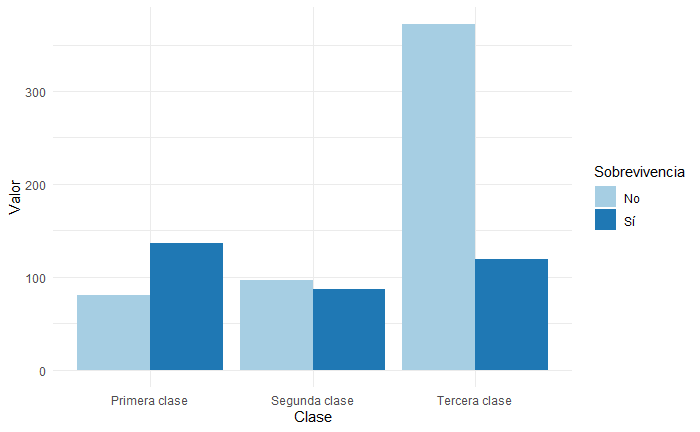
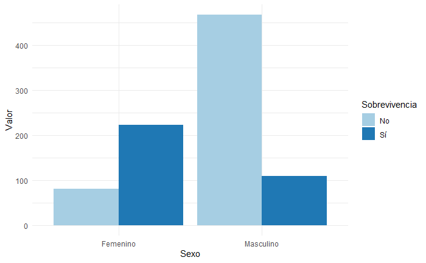
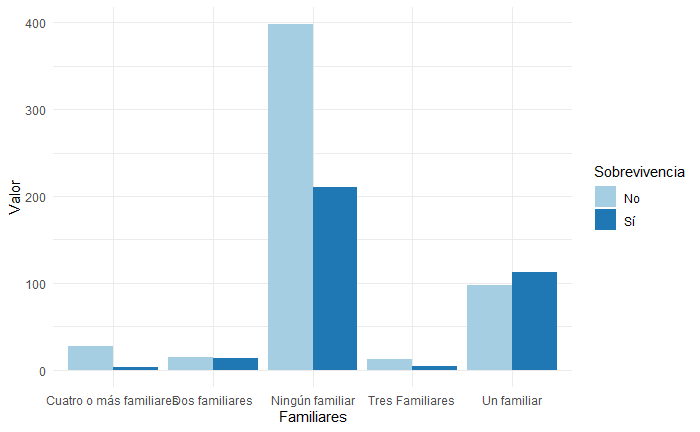
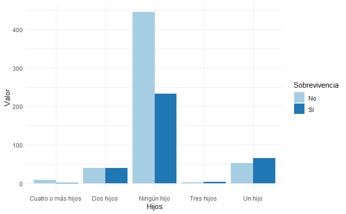
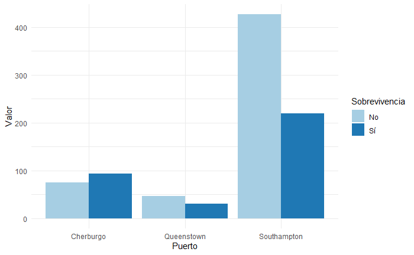

# Titanic-Survivor
Titanic-Survivor es un proyecto de clasificación que pretende predecir através de diferentes parámetros si sobrevirías a una de las catástrofes marítimas más importantes de la historia, el hundimiento del Titanic.
La tabla de datos que me permitió elaborar la aplicación fue extraída de Kaggle, la cual contiene 12 variables y 891 observaciones, la variable a predecir es Survived donde 1 = sobrevivencia y 0 = fallecimiento.

## Limpieza de la tabla.
Para realizar la aplicación, primero es necesario conocer cuáles son los datos con los que contamos y si es necesario modificarla para poder ajustar nuestros modelos correctamente.

Como lo mencioné anteriormente, la tabla cuenta con 12 variables: PassengerId, Survived, Name, Sex, Age, SibSp, Parch, Ticket, Fare, Cabin y Embarked. Dejaremos a un lado 'PassangerId', 'Name', 'Ticket' y 'Cabin', pues éstas no son variables cuantitativas ni cualitativas, solamente datos de los pasajeros. 

Los valores máximo y mínimo en las variables que no son factores serán tomados como referencia para los límites paramétricos de la aplicación, ninguna variable presenta valores extremos. Aunque la edad('Age') de los pasajeros tiene muchos valores faltantes. 

### Pclass
Pclass es una variable cualitativa que representa la clase en la que viajan, tiene tres posibles resultados: 1 = Clase Alta (aquí viaja la gente rica), 2 = Clase Media (Se les considera ricos y es la segunda más popular) y 3 = Clase Baja (Aquí viaja la mayoría de las personas).

Visiblemente existe una tendencia a sobrevivir si se viaja en primera clase, contrario a lo que sucede en tercera clase. Donde la probabilidad frecuentista de fallecer es notablemente más alta.

### Sex
En el caso del sexo, existe una mayor probabilidad de fallecer para las personas del sexo masculino. Las mujeres sobrevivieron más que los hombres, pero además hay muchas más sobrevivientes que fallecidas. Por ende es una variable de suma importancia para el modelo de clasificación. Por ser una variable cualitativa será tratada como factor.

### Age
La variable edad tiene 177 valores no faltantes. Los cuales serán remplazados por la media de edad por la clase en la que viajan. Además es una variable cuantitativa.
Media de edad primera clase | Media de edad segunda clase | Media de edad tercera clase
--------------------------- | --------------------------- | ---------------------------
42.3                        | 29.87                       | 25.14

### SibSp
La cantidad de familiares o pareja que están abordo del navío es lo que significa la variable. Dado que el valor más grande de esta variable es 8 será tratada como factor aunque puramente no lo sea.

La gráfica muestra que entre menos familiares o pareja acompañen al pasajero más probabilidades tiene de sobrevivir.

### Parch
Muy similar a SibSo, indica la cantidad de hijos que viajan abordo. Igualmente será tratada como factor. 

El comportamiento es idéntico, entre menos descendencia lleves al viaje más probabilidades tienes de sobrevivir.

### Fare
La tarifa es el precio de ticket, como esta está intimamente relacionada con la categoría en la que viaja el pasajero, se entiende que entre mayor sea la tarifa que el pasajero a pagado mejores serán sus posibilidades de vivir. Es una variable cuantitativa.

### Embarked
El Titánic sarpó de Southampton (Inglaterra), posteriormente llegó al puerto de Cherburgo (Francia) y finalmente abordó a sus últimos pasajeros en Queenstown (Irlanda). De ahí que las variables (categóricas) sean S, C y Q. Además contiene dos valores faltantes que serán reemplazados por la moda, es decir donde abordaron más pasajeros. 

La mejor relación de sobrevivencia es la de los pasajeros que abordaron en el puerto de Cherburgo.

Como paso adicional, la nueva tabla con los datos faltantes corregidos fue convertido en un csv con el nombre de "clean_data", misma que fue utilizada para el modelo y que se encuentra en la carpeta.

## Modelo
### Regresión logística.
Es un método de regresión que permite estimar la probabilidad de una variable cualitativa binaria en función de una o varias variables.
$Pr(Y_i=1|X_i) = {\frac{exp(\beta_0 + \beta_1X_i + \beta_2X_2 + \beta_3X_3 + \beta_4X_4 + \beta_5X_5)}{1 + exp (\beta_0 + \beta_1X_i + \beta_2X_2 + \beta_3X_3 + \beta_4X_4 + \beta_5X_5)}}$

### Árboles de Decisión
Los árboles de decisión representan una serie de decisiones y elecciones en forma de árbol. Usan las características de un objeto para decidir en qué clase se encuentra el objeto. Estas clases generalmente se encuentran en las hojas terminales de un árbol de decisión. Los árboles de decisión pueden ser clasificadores binarios o multiclase. Usan múltiples reglas con resultados binarios para formar una serie de comprobaciones que juzgan y dicen la clase de un objeto según sus características. Los árboles de decisión son un ejemplo de algoritmos de divide y vencerás, ya que usan las reglas para dividir los objetos repetidamente hasta que se toma una decisión final.

### Máquinas de Soporte Vectorial
Una máquina de vectores de soporte representa objetos de datos como puntos en el espacio. Luego diseña una función que puede dividir el espacio de acuerdo con las clases de salida de destino. SVM usa el conjunto de entrenamiento para trazar objetos en el espacio y ajustar la función que divide el espacio. Una vez finalizada la función, coloca los objetos en diferentes partes del espacio según la clase en la que se encuentren. Los SVM son muy livianos y altamente eficientes en espacios de dimensiones más altas.

## Resultado Final
Con mucha diferencia el mejor resultado fue el de la regresión logística, dando una precisión promedio del 80%. Es por ellos que será utilizado para crear la aplicación.
